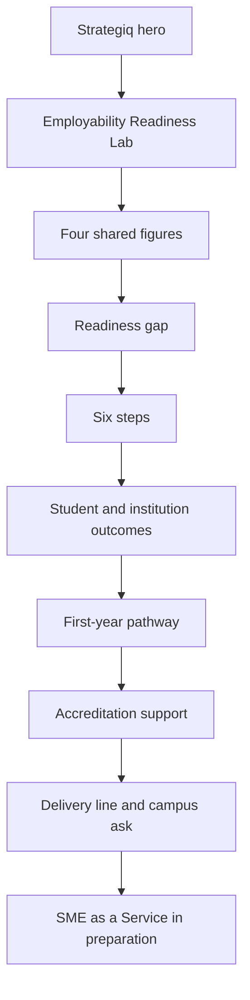

# Strategiq page

Add [strategiq.html](strategiq.html) to the existing static site. Reuse the header, footer, floating contact, tokens, and components in [styles.css](styles.css) and [design.md](design.md). No new palette, font, or breakpoint.

The two PDFs disagree on MBA vs PGDM. The page addresses **B-schools** and uses only claims present in both files.

## What the page says

Hero title is **Strategiq**. The subtitle stays generic ("Programmes from UniqShift Ventures") so it does not invent a definition for SME as a Service. Two in-page links sit under it: Employability Readiness Lab and SME as a Service.

The Lab is the full programme. Shared copy only:

- Headline: **The gap is readiness, not opportunity.** Question: how placement-ready is your first-year batch today?
- Four figures, with the existing source notes: **72.76%** employability, 2026, down from 78% in 2025 (India Skills Report 2026; not labelled MBA-only or PGDM-only); **40%** hiring intent, FY26–27, up from 29%; **56.35%** overall India employability, up from 54.81% in 2025; **~8 sec** initial CV scan, marked as a widely cited approximation, not from the report.
- Gaps show up when placement season starts, when there is no time left to close them. Recruiters look for "applied, cross-domain managerial expertise." This is a measurable view of the batch, not another CV workshop or guest lecture. Run once, it is a snapshot. Run every quarter, it is an early-warning system before placement season.
- One day on campus, six steps, a 90-day plan. The poster title says "five moves" but both files list six steps, so the page uses six: Baseline, Orientation, CV Clinic, Mock Interviews, Development Plan, 48-hour rescore. Step text is the overlap (readiness score before the day; market expectations against the batch's data; ATS, job-description tailoring, and ₹1 crore CV teardowns; live interviews, then each student takes a turn; target role, Plan B, named skill gaps, three dated goals; updated CV and plan scored again).
- Each student leaves with a personal readiness score, an ATS-ready CV, live interview practice, and a 90-day plan.
- The institution gets a batch report: who is ready, who needs support, where the gap is, and whether it moved. Scored on Career Clarity, Domain Readiness, Professional Brand, Career Capital, and Career Evidence.
- Pathway: Year 1, CV built, internship, PPO, final placement. The CV is built in the first term; by year 2 the same gaps are expensive to fix.
- Accreditation support, with the shared disclaimer that this is evidence only and does not guarantee a score, ranking, or accreditation: NAAC Criterion V, NBA Criterion 9, NIRF Graduation Outcomes. Poster-only sub-codes (5.1.2 and similar) stay off the page.
- Proof line, degree label removed: delivered 19 September 2026, 202 students, a leading business school in Chennai.
- Close with the shared ask: bring the Lab to your campus; request a sample readiness report and the full programme structure. Link to [index.html](index.html) contact. Credit Ganesh Thirunavukkarasu, Founder and CEO, linking to the existing founder section. Do not repeat the bio.

Left out on purpose: "PGDM is the one degree moving the other way," "MBA employability is falling," the print "Reply REPORT" line, and "designed and delivered by industry leaders from the campus-hiring side."

## SME as a Service

A real section, `id="sme"`, after the Lab and before the footer. It is visibly **in preparation**: the heading, one sentence that the programme is not published yet, and a link to contact. No invented description, audience, steps, or outcomes.

The section uses the same container, title, and list shell as the Lab blocks, with an HTML comment marking the copy slot, so later content can replace the pending sentence without a new layout.

## Section order

Backgrounds alternate `--color-bg` and `--color-bg-alt`. Stats reuse the glass highlight card. Steps reuse the numbered feature row. Accreditation reuses the three-column service rhythm.

## Site wiring

- New file [strategiq.html](strategiq.html). Same head pattern as the homepage: theme script before paint, Manrope, [styles.css](styles.css), favicon. Title and description describe Strategiq and the Lab. `og:url` is `https://uniqshift.com/strategiq.html`.
- Header and footer are copied, not generated. Logo and existing section links point at `index.html#...`. The Strategiq item points at `strategiq.html`, with `nav__link--active` and `aria-current="page"` on this page only.
- Add the same Strategiq link to the homepage header and footer in [index.html](index.html), after Services.
- [script.js](script.js) stays shared. Hash links on the new page smooth-scroll. Contact actions use `index.html#contact`, which the current click handler does not intercept. No contact form on this page. Floating WhatsApp and LinkedIn stay.

## Styles

Add a short block at the end of [styles.css](styles.css), token-only:

- Stat row: 4 columns by default, 2 at `968px`, 1 at `640px`.
- Pathway: one horizontal row by default, stacked at `640px`.
- Pending programme: same type and spacing as other sections, with the existing uppercase label style for "In preparation." No new color.

Check default, `968px`, and `640px`, in light and dark, and confirm `prefers-reduced-motion` still disables reveals. Do not edit [design.md](design.md). Do not commit the source PDFs.